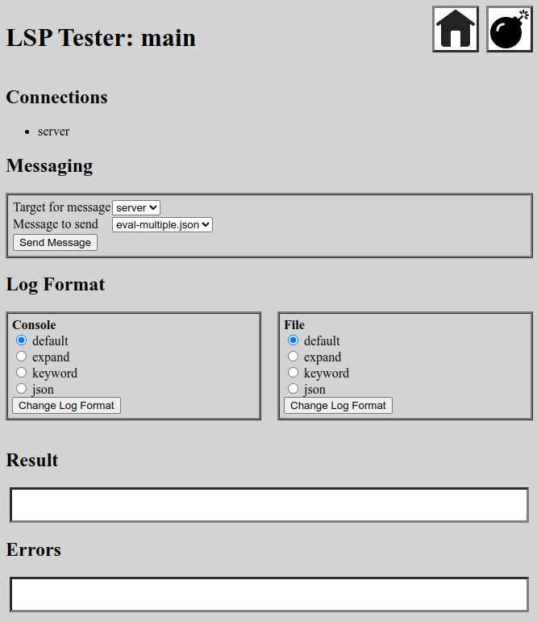

# lsp-tester
Tool to do basic testing of the communication between a VSCode language extension and
a Language Server Protocol (LSP) server providing support to that extension.

[](https://goreportcard.com/report/github.com/madkins23/lsp-tester)


[](https://pkg.go.dev/github.com/madkins23/lsp-tester)

## Notes

This tool was created to provide a view into message traffic between a VSCode extension and
the LSP server used by the extension.
The author spent some time looking for a pre-existing tool of this sort.
The only thing found appeared to be out of date and not supported.
The author is resigned to finding out tomorrow that a much better tool already exists.
[So it goes](https://en.wikipedia.org/wiki/Slaughterhouse-Five).

The impetus for this work was poking into the internals of the Common Lisp language extension
[Alive](https://github.com/nobody-famous/alive) and
its LSP server [Alive-lsp](https://github.com/nobody-famous/alive-lsp).
While this work has nothing to do with those projects or their author
(please don't bother them about this project)
the examples of log information provided below reflect Alive message traffic.
_Mea culpa_.

## Modes

The `lsp-tester` application will connect to either a LSP server or a LSP client or both.
LSP messages are logged to either the console or a file or both.

### Client

As a LSP client `lsp-tester` will connect to a running LSP specified by
a host address (which defaults to `127.0.0.1`) and client port number.
A single request packet can be read from a JSON file and sent to the LSP server.
All traffic between `lsp-tester` and the LSP server is logged.

Example:
```shell
lsp-tester -serverPort=8006 -request=<file path>
```
This is a nice way to test single requests without using VSCode.

### Server

As an LSP server `lsp-tester` will accept requests from a VSCode client
but there is at the current time no mechanism for responding.

Example:
```shell
lsp-tester -serverPort=8006
```
About all this will show is whatever startup message(s) is(are) sent when the
VSCode extension tries to connect to its REPL Server.

If the extension code is able to re-connect after its server goes down
then it might be possible to use the real server to get the extension started
and then kill the server and bring up `lsp-tester` in its place.

### Nexus

In this mode `lsp-tester` acts as both client and server,
passing LSP messages back and forth and logging them.

Example:
```shell
lsp-tester -serverPort=8006 -clientPort=8007
```
This is potentially very useful for debugging or testing
as `lsp-tester` will show all message traffic between the two.
See the **Usage Examples** section below for suggestions on how to use this mode.

## Output

Log output is written to the console and optionally to a log file.
There are four **Log Formats** described below which are available to
either console or log files and can be configured separately.
For either log destination the default format is `default`.

### Log Levels

Logging is done using [`zerolog`](https://github.com/rs/zerolog) which provides
a variety of logging levels.
The level desired can be set using the `-logLevel=<level>` flag.
Levels can be `error`, `warn`, `info`, `debug`, or `trace`.

### Console Output

Console output is always written to the standard output stream (`os.Stderr`).
There is no way to turn this off but choosing an appropriate log format
can reduce the amount of text.
Use the `-logFormat=<format>` flag to change the log format for the console.

### File Output

By default `lsp-tester` does not send output to a file.
This can be accomplished by specifying the `-logFile=<logFilePath>` flag:
```shell
lsp-tester -serverPort=8006 -clientPort=8007 -logFile=<logFilePath>
```
Use the `-fileFormat=<format>` flag to change the log format for the log file.

By default, each invocation of `lsp-tester` with a log file defined
will cause the old log file to be truncated on open.
To cause new messages to be appended to a pre-existing log file use flag `-fileAppend`:
```shell
lsp-tester -serverPort=8006 -clientPort=8007 -logFile=<logFilePath> -fileAppend
```
In this case a blank line will be emitted to separate the new messages from the old ones:
```
09:39:52 INF Send !=tester-->server #size=125 msg={"id":"81","jsonrpc":"2.0","method":"$/alive/eval","params":{"package":"cl-user","storeResult":true,"text":"(+ 2 (/ 15 5))"}}
09:39:52 INF Rcvd !=tester<--server #size=58 msg={"jsonrpc":"2.0","method":"$/alive/refresh","params":{}}
09:39:52 INF Rcvd !=tester<--server #size=49 msg={"id":"81","jsonrpc":"2.0","result":{"text":"5"}}
09:39:52 INF Rcvd !=tester<--server #size=58 msg={"jsonrpc":"2.0","method":"$/alive/refresh","params":{}}

09:39:59 INF Send !=tester-->server #size=125 msg={"id":"81","jsonrpc":"2.0","method":"$/alive/eval","params":{"package":"cl-user","storeResult":true,"text":"(+ 2 (/ 15 5))"}}
09:39:59 INF Rcvd !=tester<--server #size=58 msg={"jsonrpc":"2.0","method":"$/alive/refresh","params":{}}
09:39:59 INF Rcvd !=tester<--server #size=49 msg={"id":"81","jsonrpc":"2.0","result":{"text":"5"}}
09:39:59 INF Rcvd !=tester<--server #size=58 msg={"jsonrpc":"2.0","method":"$/alive/refresh","params":{}}
```

### Log Formats

Specific conventions used in all output formats:

| Example             | Definition                          |
|---------------------|-------------------------------------|
| `!=client-->server` | Direction of message                |
| `#size=125`         | Size of content from message header |

In all formats but `json` these will be at the left of every line
after the timestamp, log level, and message text.
In `json` mode these fields will still be present but not as easy to find.

The message direction is configured so that the `client`, when present, is on the left and
the `server`, when present, is on the right.
If either the client or the server is absent any messages will replace the missing
entity with `tester`, representing `lsp-tester` itself.

In the examples below the use of `logFormat=<format>` always imply
the same behavior for log files by using `fileFormat=<format>`.
These are separate settings but work the same.

#### Format: `default`

Console output provides a line per message by default.

For example:
```shell
lsp-tester serverPort=8006 -request=<file path>
```
might result in the following:
```
16:13:30 INF LSP starting
16:13:30 INF Send !=tester-->server #size=123 msg={"id":81,"jsonrpc":"2.0","method":"$/alive/eval","params":{"package":"cl-user","storeResult":true,"text":"(+ 2 (/ 15 5))"}} source=file
16:13:30 INF Rcvd !=tester<--server #size=58 msg={"jsonrpc":"2.0","method":"$/alive/refresh","params":{}}
16:13:30 INF Rcvd !=tester<--server #size=47 msg={"id":81,"jsonrpc":"2.0","result":{"text":"5"}}
16:13:30 INF Rcvd !=tester<--server #size=58 msg={"jsonrpc":"2.0","method":"$/alive/refresh","params":{}}
```
This is the default format for output.

#### Format: `expand`

The JSON content of the `msg` field can also be expanded using:
```shell
lsp-tester -logFormat=expand -serverPort=8006 -request=<file path>
```
so that the previous log data would show as:
```
16:14:24 INF LSP starting
16:14:24 INF Send !=tester-->server #size=123 source=file
{
  "id": 81,
  "jsonrpc": "2.0",
  "method": "$/alive/eval",
  "params": {
    "package": "cl-user",
    "storeResult": true,
    "text": "(+ 2 (/ 15 5))"
  }
}
16:14:24 INF Rcvd !=tester<--server #size=58
{
  "jsonrpc": "2.0",
  "method": "$/alive/refresh",
  "params": {}
}
16:14:24 INF Rcvd !=tester<--server #size=47
{
  "id": 81,
  "jsonrpc": "2.0",
  "result": {
    "text": "5"
  }
}
16:14:24 INF Rcvd !=tester<--server #size=58
{
  "jsonrpc": "2.0",
  "method": "$/alive/refresh",
  "params": {}
}
```

#### Format `keyword`

On the other hand, large amounts of data can sometimes be generated
(especially during initialization) so there is a mode that attempts to
analyze the traffic and show the most useful bits:
```shell
lsp-tester -logFormat=keyword -serverPort=8006 -request=<file path>
```
in which the previous log data would show as:
```
07:30:48 INF LSP starting
07:30:48 INF Receiver starting to=server
07:30:48 DBG Connected to=server
07:30:48 INF Send !=tester-->server #size=125 $Type=request %ID=81 %method=$/alive/eval <package=cl-user <storeResult=true <text="(+ 2 (/ 15 5))"
07:30:48 INF Rcvd !=tester<--server #size=58 $Type=notification %method=$/alive/refresh
07:30:48 INF Rcvd !=tester<--server #size=49 $Type=response %ID=81 <>method=$/alive/eval <>package=cl-user <>storeResult=true <>text="(+ 2 (/ 15 5))" >text=5
07:30:48 INF Rcvd !=tester<--server #size=58 $Type=notification %method=$/alive/refresh
```
This mode attempts to pull out key fields and only show small blocks of meaningful data.
Specific conventions used in this format:

| Example                   | Definition                                         |
|---------------------------|----------------------------------------------------|
| `$Type=request`           | Type of message [^1]                               |
| `%ID=81`                  | Message ID                                         |
| `%method=$/alive/eval`    | Method for request                                 |
| `<text="(+ 2 (/ 15 5))`   | Parameter with name prefixed by `<`                |
| `>text=5`                 | Result item with name prefixed by `>`              |
| `<>method=$/alive/eval`   | Method from request provided with response [^2]    |
| `<>text="(+ 2 (/ 15 5))"` | Parameter from request provided with response [^2] |                                 

[^1]: The `$Type` of message is derived from the available fields.
There is no specific "type" field in the Language Server Protocol
so this derivation is somewhat fuzzy and may be wrong sometimes.

[^2]: Method and parameter data from requests is stored by ID,
looked up when a response message is found with the same ID, and
added to the log entry for the response using the `<>` prefix.
This data is not actually in the response message.

#### Format: `json`

It is also possible to generate the log statements as individual JSON records:
```shell
lsp-tester -logFormat=keyword -serverPort=8006 -request=<file path>
```
in which the previous log data would show as:
```
{"level":"info","time":"2023-05-06T17:25:54-07:00","message":"LSP starting"}
{"level":"debug","!from":"tester","!to":"server","#size":123,"msg":{"jsonrpc":"2.0","id":81,"method":"$/alive/eval","params":{"package":"cl-user","storeResult":true,"text":"(+ 2 (/ 15 5))"}},"time":"2023-05-06T17:25:54-07:00","message":"Send"}
{"level":"debug","&test":"client","!from":"server","!to":"tester","#size":58,"msg":{"jsonrpc":"2.0","method":"$\/alive\/refresh","params":{}},"time":"2023-05-06T17:25:54-07:00","message":"Received"}
{"level":"debug","&test":"client","!from":"server","!to":"tester","#size":47,"msg":{"id":81,"jsonrpc":"2.0","result":{"text":"5"}},"time":"2023-05-06T17:25:54-07:00","message":"Received"}
{"level":"debug","&test":"client","!from":"server","!to":"tester","#size":58,"msg":{"jsonrpc":"2.0","method":"$\/alive\/refresh","params":{}},"time":"2023-05-06T17:25:54-07:00","message":"Received"}
```

## Web Server

An embedded web server provides some interactive control over `lsp-tester`.
The following functionality may be invoked while the tester is running:
* Change the log format for console or file output.
* Send messages stored in files to server or client.

### Starting the Web Server

The web server is only started if a `-webPort` flag is specified with a non-zero value:
```
lsp-tester -serverPort=8006 -clientPort=8007 -webPort=8008
```

The server will be accessible from a browser at `http://localhost:<webPort>`.
The main (and currently only) page:



#### Icons

The generic "house" icon invokes the main page which is already displayed.
This is mostly handy for re-executing the page after restarting `lsp-tester`.
It will also clear the **Result** and **Errors** boxes.

The "bomb" icon executes a graceful shutdown of `lsp-tester`.

#### Connections

All current connections are displayed.
There can only be a single `server` connection,
but there can be multiple numbered `client-#` connections over time
(and theoretically at the same time).

#### Messaging

Messaging requires a directory of `.json` message files.
The `-messages` flag specifies the path to this directory:
```
lsp-tester -serverPort=8006 -clientPort=8007 -webPort=8008 -messages=<dirPath>
```
The `-messages` flag is only used when `-webPort` is used to activate the web server.
Message files are `.json` files with properly configured LSP messages.

On the main web page set the target for the message via the provided drop-down
which will have an entry for each current connection.
Use the message drop-down to set the message to be sent.
The `Send Message` button will send the actual message.

#### Change Log Format

The log format can be changed while `lsp-tester` is running.
There are side-by-forms for **Console** and **File** output format
(the latter will only be displayed if a log file is configured using the `-logFile` flag).
For each form the four radio buttons represent the three log formats
as described above in the **Output** section.
Select one of the log formats and use the `Change Log Format` button.
All subsequent messaging will be in the new format until changed again.

### Output

Output from `lsp-tester` will continue to be to the console and optionally a log file.
There is currently no provision for seeing the log via the web interface
which is used only to control `lsp-tester`.

### Usage Examples

#### Client Mode with Request

This is the original use case for `lsp-tester`.

1. Bring up the LSP server with a specified port.
2. Run `lsp-tester` specifying:
   * the LSP server port in `-serverPort`,
   * a JSON request file in `-request`, and
   * whatever non-default `-logFormat` is desired

After connecting to the server the request will be sent to the server.
This a quick test that a particular LSP feature returns the expected traffic.

After the message traffic `lsp-tester` continues running,
mostly because it isn't possible to determine when the server response traffic is done.
Kill the program with `<ctrl>-C` (or via the web interface if it is configured).

#### Nexus Mode with File Output

Initialization traffic between the VSCode extension host and the LSP server can be quite large.
It is possible to have the best of both worlds by configuring the log file output:

1. Bring up the LSP server with a specified port.
2. Run `lsp-tester` specifying:
    * the LSP server port in `-serverPort`,
    * an appropriate port in `-clientPort`,
    * a log file in `-logFile=<logFilePath>`,
    * small console output like `-logFormat=keyword`, and
    * large file format like `fileFormat=expand` or `fileFormat=json`.
3. Configure the VSCode extension to contact the chosen `lsp-tester` `-clientPort`.
4. Start the extension or restart it via the **Developer: Reload Window** command.

Console logging will give the gist of the message traffic and
file logging will capture the full messages for later examination.

Hint: if available, a second shell window or tab running `tail -f <logFilePath>`
will show the expanded traffic in real time.

#### Nexus Mode with Web Interface

The web interface provides the means to execute complex testing scenarios:

1. Bring up the LSP server with a specified port.
2. Run `lsp-tester` specifying:
   * the LSP server port in `-serverPort`,
   * an appropriate port in `-clientPort`, and 
   * a small output like `-logFormat=keyword`.
3. Configure the VSCode extension to contact the chosen `lsp-tester` `-clientPort`.
4. Start the extension or restart it via the **Developer: Reload Window** command.
5. Wait for the initialization traffic to clear in the `lsp-tester` output stream.
6. Use the web interface to change the output format to `default` or `expand`.
7. Use the web interface to send any desired message to either the extension or the LSP server.

This scenario handles two problems:

1. The initialization traffic between the extension and the LSP server can be large.
2. It is useful to be able to send messages in both directions once the connection has started.

## Command Line Flags

| Flag            | Type     | Description                                          |
|-----------------|----------|------------------------------------------------------|
| `-host`         | `string` | LSP server host address (default `"127.0.0.1"`)      |
| `-clientPort`   | `uint`   | Port number served for extension client to contact   |
| `-serverPort`   | `uint`   | Port number on which to contact LSP server           |
| `-webPort`      | `uint`   | Port for web server for interactive control          |
| `-logLevel`     | `string` | Set the log level (see below                         |
| `-logFormat`    | `string` | Format value for console output (see below)          |
| `-logMsgTwice`  | `bool`   | Show each message twice with `tester` in the middle. |
| `-logFile`      | `string` | Log file path (default no log file)                  |
| `-fileAppend`   | `bool`   | Append to any pre-existing log file                  |
| `-fileFormat`   | `string` | Format value for log file (see below)                |
| `-request`      | `string` | Path to file to be sent when connected (client mode) |
| `-messages`     | `string` | Path to directory of message files (for Web server)  |
| `-help`         | `bool`   | Show usage and flags                                 |

Boolean flags (e.g. `-fileAppend` and `-help`) do not require a value.
The presence of such a flag indicates a value of `true`.

Format values can be set separately for console output and optional log file.

| Value     | Description                                                    |
|-----------|----------------------------------------------------------------|
| `default` | Linear format with messages output as single-line JSON         |
| `expand`  | Linear format with message content appended as multi-line JSON |
| `keyword` | Linear format with messages parsed to key fields               |
| `json`    | JSON object with message content embedded as more JSON         |

It is not necessary to specify `default` for `-logFormat` or `-fileFormat`.

Log level applies to the entire application.
Choices are specified in the following table.

| Value   | Description                  |
|---------|------------------------------|
| `error` | Messages specifying errors   |
| `warn`  | Messages specifying warnings |
| `info`  | Informational messages       |
| `debug` | Debugging messages           |
| `trace` | Trace messages               |

Each value includes itself and all messages above it in the table.
The default value is `info`.

The `logMsgTwice` flag converts
```
17:29:31 INF Send !=client-1-->server #size=122 $Type=request %ID=8 %method=$/alive/eval <package=cl-user <storeResult=true <text="(+ 2 (/ 15 5))"
17:29:31 INF Send !=client-1<--server #size=46 $Type=response %ID=8 <>method=$/alive/eval <>package=cl-user <>storeResult=true <>text="(+ 2 (/ 15 5))" >text=5
```
to
```
17:36:34 INF Rcvd !=client-1-->tester #size=122 $Type=request %ID=8 %method=$/alive/eval <package=cl-user <storeResult=true <text="(+ 2 (/ 15 5))"
17:36:34 INF Send !=tester-->server #size=122 $Type=request %ID=8 %method=$/alive/eval <package=cl-user <storeResult=true <text="(+ 2 (/ 15 5))"
17:36:34 INF Rcvd !=tester<--server #size=46 $Type=response %ID=8 <>method=$/alive/eval <>package=cl-user <>storeResult=true <>text="(+ 2 (/ 15 5))" >text=5
17:36:34 INF Send !=client-1<--tester #size=46 $Type=response %ID=8 <>method=$/alive/eval <>package=cl-user <>storeResult=true <>text="(+ 2 (/ 15 5))" >text=5
```
to show the role of `lsp-tester` in passing messages back and forth.
This may not be very useful except when demonstrating that `lsp-tester` is not functional.
